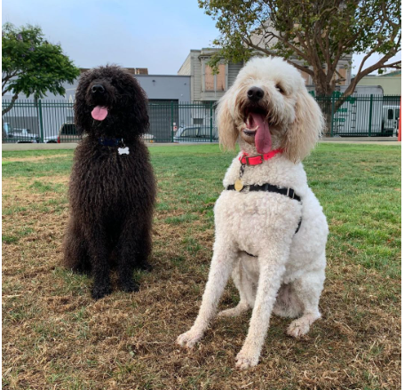

## 0x0E. C - Structures, typedef

In all you do know this, _Dog is man's best friend_


### Table of Contents

-   [General](#general)
-   [Side note](#side-note)
-   [My lines](#lines)
-   [Tasks](#tasks)

### General

-   What are structures, when, why and how to use them
-   How to use `typedef`

### Side Note 🎼

_Nobody_ :

_mazi Eben :_ The thing about dogs is they are beautifully structured



### My Lines 🎙

**dog.h**

```c
/**
 * struct dog - define a new type struct dog
 * @name: char *
 * @age: float
 * @owner: char *
 *
 * Description: longer description
 */
struct dog
{
	char *name;
	float age;
	char *owner;
};
```

**2-print_dog.c**

```c
printf("Age: ");
print_fproperty(&(*d).age);
```

### Tasks

## 0. Poppy 🐶🐕

Define a new type `struct dog` with the following elements:

-   `name`, type = `char *`
-   `age`, type = `float`
-   `owner`, type = `char *`

_File: `dog.h`_

## 1. A dog is the only thing on earth that loves you more than you love yourself 🐶💘

Write a function that initialize a variable of type `struct dog`

-   Prototype:

```c
void init_dog(struct dog *d, char *name, float age, char *owner);
```

_File: `1-init_dog.c`_

## 5. How many legs does a dog have if you call his tail a leg? Four. Saying a tail is a leg doesn't make it a leg 🐶

Write a function that frees dogs

-   Prototype:

```c
void free_dog(dog_t *d);
```

_File: `5-free_dog.c`_

### Feel free to peruse through this repository and see the beauty of ~~dogs~~ 🐶 😂😂 I mean structures 🏗
